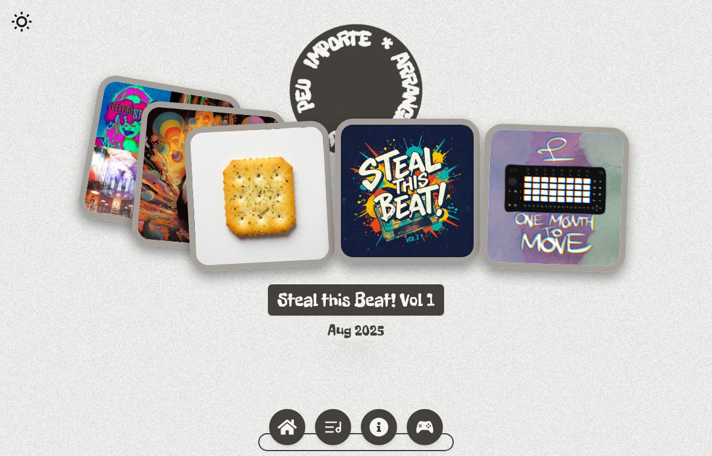
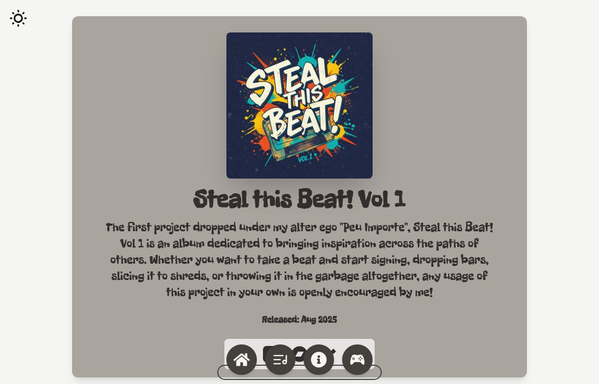

# Arranged Godly

### Music, devices, and games in an animated portfolio.

The source for Arranged Godly's creative website: a React interface built around album artwork, an interactive navigation dock, motion-driven backgrounds, product links, and an embedded game.

**[Visit arrangedgodly.com](https://arrangedgodly.com/) · [Explore the interface](#explore-the-interface) · [Stack](#how-the-site-is-built) · [Run locally](#run-locally) · [Update content](#update-the-content)**



## Explore the interface

| Surface | Interaction | Destination |
| --- | --- | --- |
| **Album cards** | Hover on desktop to emphasize a cover and reveal its title/release date; select a cover to open its page. | `/albums/:url` |
| **Circular artist mark** | A rotating wordmark responds to hover with faster motion and a smaller scale. | Decorative home-page interaction. |
| **Bottom dock** | Pointer-responsive icons navigate between Home, Max for Live, About Me, and Games. Labels appear on hover/focus. | Main site sections. |
| **Theme switch** | Changes the light/dark palette and remembers the choice in this browser. | Shared across the app. |
| **Album service icons** | Follow the configured external music-service links. | Listening pages outside this website. |
| **Game card** | Select Magic Gunden from the games section. | Embedded itch.io game page. |

The site is a portfolio and discovery surface. Music-service links take you to listening platforms; the portfolio itself does not include an album audio player or Max device editor.

## Follow an album from cover to release



Album pages combine a cover, description, release date, and platform links with an animated entrance and beam background.

| Release | Date displayed | Route slug |
| --- | --- | --- |
| **Seasonal Aggression: The Mixtape** | September 2021 | `SATM` |
| **Taxed, Tolled & Eternally Trolled** | September 2023 | `TTNET` |
| **One Seasoned Cracker** | May 2025 | `OSC` |
| **Steal this Beat! Vol 1** | August 2025 | `STB1` |
| **One Month to Move** | October 2025 | `OMTM` |

Platform destinations are data-driven and vary by release. The current catalog includes Amazon Music, Apple Music, Bandcamp, Tidal, and YouTube Music fields; not every release has all five populated.

## Other sections

| Route | Source implementation |
| --- | --- |
| **`/max`** | A tilted, looping list of six Max for Live product cards with Gumroad destinations, a galaxy background, and electric borders. |
| **`/about`** | A personal introduction with reactive typography, changing focus across interests, and a dithered background. |
| **`/games`** | A pointer-tilting Magic Gunden card over a prism backdrop. |
| **`/magic-gunden`** | A full-viewport itch.io iframe for the game. The game source is not included in this repository. |

The Max list supports wheel, touch, and pointer-drag interaction in its implementation, alongside automatic scrolling. This repository contains the website's product cards and links, not the downloadable `.amxd` device packages.

## How the site is built

| Layer | Technology | Actual role |
| --- | --- | --- |
| **Interface** | React 19 + React DOM | Component UI and shared theme/card state. |
| **Navigation** | React Router | Six client-side route definitions. |
| **Build** | Vite + React Compiler plugin | Development server, production bundle, and compiler integration. |
| **Styling** | Tailwind CSS + daisyUI | Responsive utilities and common card/menu/hero patterns. |
| **Card and list motion** | GSAP | Album-card animation, entrances, and list interactions. |
| **Dock and gestures** | Motion | Magnification, circular text, and tilt behavior. |
| **Beam background** | Three.js, React Three Fiber, Drei | The album page's 3D-rendered visual background. |
| **Post-processing** | React Three Postprocessing + postprocessing | Dither effects. |
| **Additional shaders** | OGL | Galaxy and prism visuals. |
| **Icons** | React Icons | Dock destinations and external service links. |
| **Local preference** | localStorage | The selected theme. |

The app has no backend, account system, database, or required API credentials in the examined source. Artwork, fonts, external listening/product links, and the embedded game depend on their respective hosts and browser capabilities.

### State and presentation

`App.jsx` holds the theme and active album-card state. Theme changes persist under `userTheme`; card selection is passed through context to the home presentation. Album pages use their URL slug to look up the matching record in `src/constants/albums.js`.

Below 640 px, the album-card code disables its desktop hover choreography, removes the card transforms, and wraps smaller cards. Those accommodations should be checked alongside viewport-height wrappers and longer album descriptions before claiming complete mobile polish.

## Run locally

Use Node.js 22.12+ and npm, then install from the committed lockfile:

```bash
git clone https://github.com/Arrangedgodly/ag-2025.git
cd ag-2025
npm ci
npm run dev
```

Open the address printed by Vite.

| Command | Purpose |
| --- | --- |
| `npm run dev` | Starts Vite's development server. |
| `npm run build` | Creates the production site in `dist/`. |
| `npm run preview` | Serves an existing production build locally. |
| `npm run lint` | Runs ESLint over the project. |

There is no test script or conventional automated test suite in the inspected repository. A production static host needs single-page-app fallback to `index.html` for direct route loads. That requirement is separate from a successful Vite build.

## Update the content

| Change | Edit |
| --- | --- |
| Album title, cover, description, date, slug, or platform links | [`src/constants/albums.js`](src/constants/albums.js) |
| Max product name, image, dimensions, or Gumroad link | [`src/constants/devices.js`](src/constants/devices.js) |
| Main dock destinations | [`src/components/BottomDock.jsx`](src/components/BottomDock.jsx) |
| Routes and shared state | [`src/App.jsx`](src/App.jsx) |
| Personal introduction | [`src/components/About.jsx`](src/components/About.jsx) |
| Game card | [`src/components/Games.jsx`](src/components/Games.jsx) |
| Embedded game target | [`src/components/MagicGunden.jsx`](src/components/MagicGunden.jsx) |
| Fonts and utility-style setup | [`src/index.css`](src/index.css) |

After adding an album, verify its slug by opening the detail URL directly, check each external link, and review the page at desktop and phone widths. Missing or empty destinations should be handled intentionally rather than advertised as available links.

## Current review boundaries

- The included screenshots show the actual home and album pages.
- The Max route exists in source, but its live rendering remains unverified after a blank-page observation during the visual review.
- Unknown album slugs currently have no explicit fallback in the detail component, and there is no catch-all route.
- WebGL effects, motion, image loading, external links, and game embedding need browser/device checks beyond static source inspection.
- Dependencies and external artwork/fonts have their own usage terms. The repository does not include a general license granting unrestricted reuse of every asset.
